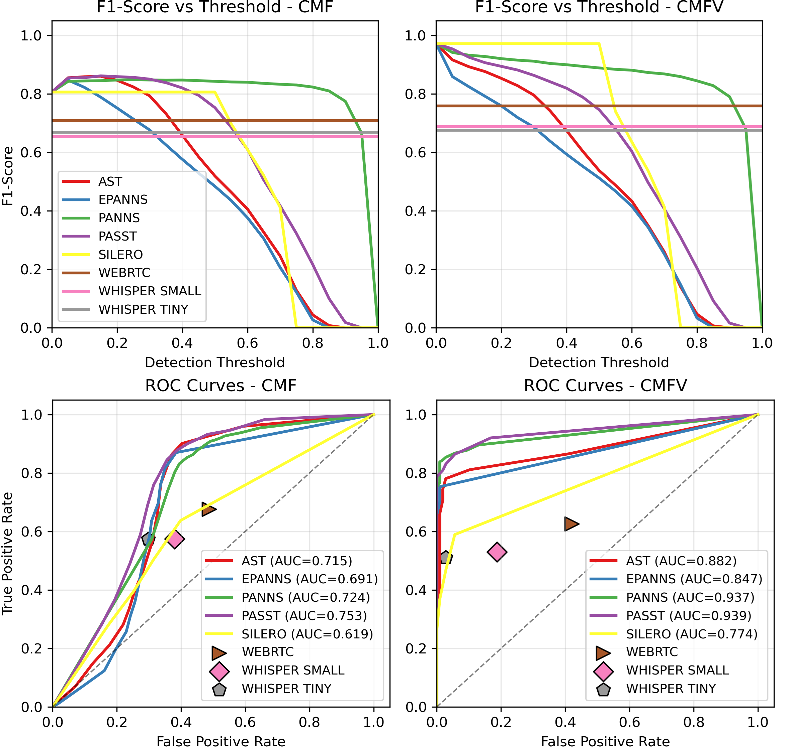
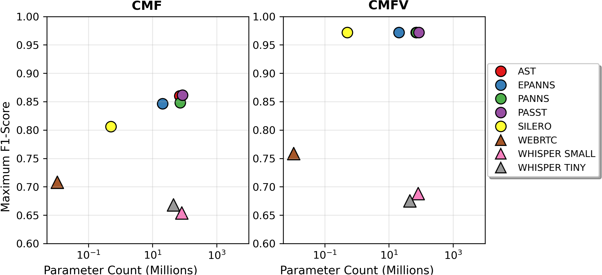

# VAD-Benchmark: Voice Activity Detection Evaluation Framework

This repository contains code and evaluation tools for the paper:

**"Privacy-Preserving Voice Activity Detection: Evaluating AI Model Performance on Domestic Audio"**  
*Gabriel Bibbo, Arshdeep Singh, Mark D. Plumbley*  
Centre for Vision Speech & Signal Processing (CVSSP), University of Surrey, UK  
Detection and Classification of Acoustic Scenes and Events (DCASE) 2025

## Installation

### Option 1: Automatic Installation (Recommended)

```bash
# 1. Install everything (creates environment + downloads model weights ~500MB)
./install.sh

# 2. Activate environment  
source activate_vad.sh

# 3. Test installation
python test_installation.py
```

### Option 2: Manual Installation

#### 1. Install PyTorch (CPU by default)

Install PyTorch according to your platform (official guide):

```bash
pip install --index-url https://download.pytorch.org/whl/cpu torch torchaudio torchvision
```

#### 2. Install remaining dependencies

```bash
pip install -r requirements.txt
```

> **Note**: If `soundfile` gives an error about `libsndfile`, check the official documentation; on some distributions you may need to install `libsndfile` from your system package manager.

#### 3. Test installation

```bash
python test_installation.py
```

## Quick Start

```bash
# Run demo evaluation
python scripts/run_evaluation.py --config configs/config_demo.yaml
```

## CHiME-Home Dataset Setup

To reproduce the exact paper results, you need the CHiME-Home dataset:

### 1. Download CHiME-Home Dataset

Get the CHiME-Home dataset from the CHiME Challenge website:

```bash
# Create dataset directory
mkdir -p datasets/chime/chunks

# Download CHiME-Home dataset
# Visit: https://www.chimehome.org/ 
# Or use the direct download link from CHiME organizers
# Extract audio files to: datasets/chime/chunks/

# Expected structure:
# datasets/chime/chunks/
# ├── CR_lounge_220110_0731.s0_chunk0.wav
# ├── CR_lounge_220110_0731.s0_chunk1.wav
# ├── ...
# └── [additional 4-second audio chunks at 16kHz]
```

### 2. Alternative: Use Download Script

If available, you can use the provided download script:

```bash
# Make download script executable
chmod +x download_chime.sh

# Download dataset automatically
./download_chime.sh

# Verify dataset structure
ls -la datasets/chime/chunks/ | head -10
```

### 3. Dataset Requirements

- **Format**: WAV files, 16kHz sample rate
- **Duration**: 4-second chunks
- **Size**: ~1946 files for full evaluation
- **Scenarios**: CMF (Child, Male, Female) and CMFV (+ Television)
- **Ground Truth**: Files in `ground_truth/chime/cmf.csv` and `ground_truth/chime/cmfv.csv`

## Paper Results

### 1. Run Paper Evaluations
```bash
# Human speech detection (CMF scenario) - Table results from paper
python scripts/run_evaluation.py --config configs/config_chime_cmf.yaml

# Broad vocal content detection (CMFV scenario)  
python scripts/run_evaluation.py --config configs/config_chime_cmfv.yaml

# Run all models on both scenarios
python scripts/run_all_scenarios.py --config configs/config_paper_full.yaml
```

### 2. Results Location
- Individual metrics: `results/metrics_[model].json`
- Comparison plots: `results/comparison_all_models.png`
- Logs: `results/evaluation_[timestamp].log`

**Ground truth annotations** are in `ground_truth/chime/`

## Key Findings

The evaluation results show clear patterns in VAD model behavior:



**What the results tell us:**
- **CMF Scenario** (detecting human speech): PaSST and AST models work best (F1 = 0.86)
- **CMFV Scenario** (detecting any vocal content): Most models reach F1 = 0.97, making this task easier
- **ROC Curves** show model trade-offs between catching true speech vs avoiding false alarms
- **Threshold sensitivity** varies greatly between models



**Model efficiency patterns:**
- **Small models** (Silero, WebRTC) offer good value: decent F1 scores with tiny memory footprint
- **Large models** (80M+ parameters) give the best F1 scores but cost much more memory
- **Sweet spot** appears around 24M parameters (EPANNs) for balanced efficiency

## VAD Models Tested

The framework tests 8 VAD models across 4 families:

| Family | Models | CMF F1-Score |
|--------|--------|--------------|
| **Lightweight VAD** | Silero, WebRTC | 0.806, 0.708 |
| **AudioSet Pre-trained** | PANNs, EPANNs, AST, PaSST | 0.848, 0.847, 0.860, 0.861 |
| **Speech Recognition** | Whisper-Tiny, Whisper-Small | 0.668, 0.654 |

*Results for CMF scenario (human speech detection)*

## Run Your Own Tests

This repository includes scripts for deep dive evaluation:

### 1. Run Tests

```bash
# Go to test scripts
cd analysis/scripts/

# Run complete VAD tests  
python analyze_vad_results.py

# Run parameter count vs F1 tests
python analyze_vad_parameters.py

# Compare ground truth versions (if needed)
python compare_gt_old_new.py
```

### 2. Generated Outputs

The test scripts create publication-ready figures and metrics:

```
analysis/data/Figures/
├── f1_vs_threshold_comparison.png          # F1 score comparisons
├── accuracy_vs_threshold_comparison.png    # Accuracy comparisons
├── roc_curves_comparison.png               # ROC curve tests
├── pr_curves_comparison.png                # Precision-Recall curves
├── performance_vs_speed_comparison.png     # F1 vs RTF scatter plots
├── parameter_count_vs_performance_*.png    # Model size vs F1 score
├── performance_summary_cmf.csv             # CMF scenario metrics
├── performance_summary_cmfv.csv            # CMFV scenario metrics
└── parameter_count_analysis.csv            # Efficiency tests
```

### 3. What You Get

- **Side-by-side comparisons**: CMF vs CMFV scenario results
- **Speed tests**: Real-Time Factor (RTF) vs F1-score relationships  
- **Efficiency tests**: Parameter count vs F1 score trade-offs
- **Threshold tests**: How models behave across different VAD thresholds
- **ROC/PR Curves**: Detailed classification metrics


## Project Structure

```
vad_benchmark/
├── install.sh                    # Automatic installer
├── configs/                     # Evaluation setups
│   ├── config_demo.yaml           # Demo with test data
│   ├── config_chime_cmf.yaml      # Paper: Human speech scenario
│   └── config_chime_cmfv.yaml     # Paper: Broad vocal content
├── analysis/                    # Test suite
│   ├── scripts/                   # Test scripts
│   ├── data/                     # Results and ground truth data
│   └── figures/                  # Generated plots and figures
├── ground_truth/               # Paper ground truth annotations  
│   └── chime/                 # CHiME-Home labels (CMF/CMFV)
├── datasets/                   # Dataset directory
│   └── chime/chunks/           # CHiME-Home audio files (download required)
├── src/wrappers/              # VAD model code
├── scripts/                   # Evaluation scripts
├── models/                    # Downloaded model weights
└── results/                   # Output metrics and plots
```

## System Requirements

- **Python**: 3.9+
- **Storage**: 2GB (models + dependencies)
- **Memory**: 4GB RAM recommended
- **OS**: Linux, macOS, Windows (WSL supported)

The installer handles all dependencies including PyTorch (CPU version for stability).

## Troubleshooting

- Check the installation test: `python test_installation.py`
- Verify dataset structure: `ls datasets/chime/chunks/ | wc -l` (should show ~1946 files)
- Review evaluation logs in `results/evaluation_*.log`

## Citation

```bibtex
@inproceedings{bibbo2025privacy,
  title={Privacy-Preserving Voice Activity Detection: Evaluating AI Model Performance on Domestic Audio},
  author={Bibbo, Gabriel and Singh, Arshdeep and Plumbley, Mark D.},
  booktitle={Detection and Classification of Acoustic Scenes and Events 2025},
  year={2025},
  address={Barcelona, Spain}
}
```

## License

MIT License - see [LICENSE](LICENSE) file for details.

---

**Repository**: https://github.com/gbibbo/vad_benchmark  
**Paper**: DCASE 2025 Conference Proceedings